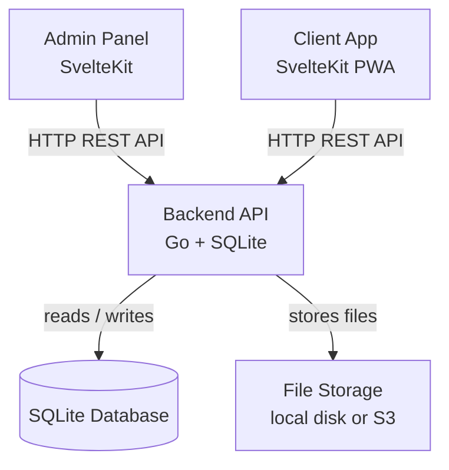
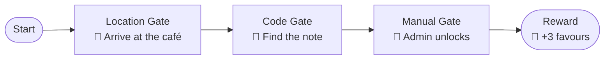
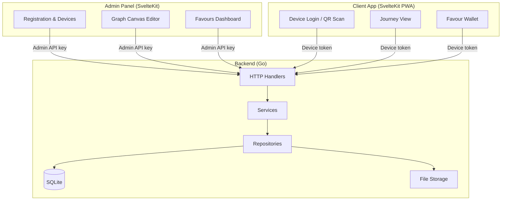
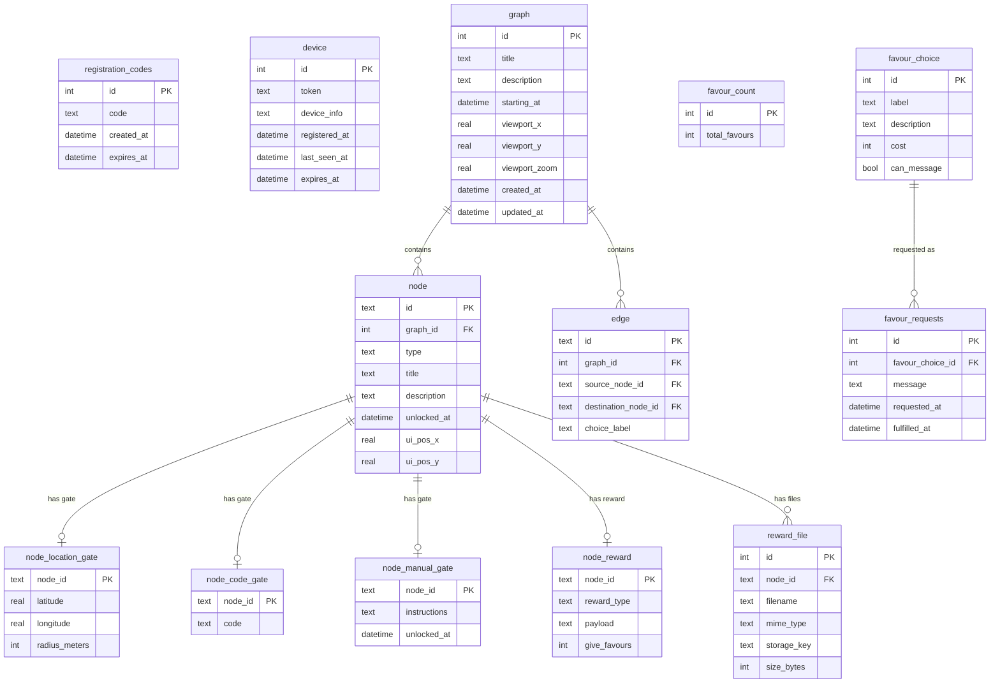

# Eros

A self-hosted platform for creating interactive, graph-based experiences for a single partner device. Design branching reward journeys with location gates, secret codes, manual unlocks, and a favour system — then watch your partner navigate them from their phone.

## Overview

Eros is built around three components that work together:

- **Admin panel** — a web UI where you design graphs, manage device registration, and handle favour requests
- **Client app** — a Progressive Web App (PWA) installed on your partner's device; they follow their journey here
- **Backend API** — a Go HTTP server that connects both apps to an SQLite database



## Features

### Graph-based reward journeys

Build branching narratives using a visual canvas. Each graph is a directed acyclic graph of **nodes** connected by **edges**. Nodes unlock in sequence as your partner satisfies each gate condition.

| Node type | How it unlocks |
|-----------|----------------|
| **Start** | Unlocked immediately when the graph becomes active |
| **Location** | Partner must be within a set radius of a GPS coordinate |
| **Code** | Partner enters a secret code (e.g. hidden on a note) |
| **Manual** | You unlock it from the admin panel |
| **Reward** | Delivers content (HTML, media) and optionally grants favours |



### Favour system

Favours are a currency your partner earns from reward nodes and redeems for pre-defined treats. As admin you control the catalogue of choices, monitor the balance, and mark requests as fulfilled.

### Device registration via QR code

The client app supports no traditional accounts. You generate a single-use registration code, export it as a printable PDF with a QR code, and your partner scans it to register their device. Only one device can be registered at a time.

### Secure by design

- The admin panel is protected by an API key you set at startup — it never leaves your server
- The client app uses a per-device bearer token issued at registration
- SQLite WAL mode and busy-timeout settings keep data consistent under concurrent reads

## Architecture



### Backend layers

| Layer | Package | Responsibility |
|-------|---------|----------------|
| Handler | `internal/handler` | Parse HTTP requests, validate input, write responses |
| Service | `internal/service` | Business logic (auth, graphs, favours, files) |
| Repository | `internal/repository/sqlite` | SQL queries against SQLite |
| Storage | `internal/repository/storage` | File read/write (local or S3) |

## Getting started

### Prerequisites

| Tool | Minimum version |
|------|-----------------|
| Go | 1.23 |
| Node.js | 20 |
| npm | 10 |

### 1 — Configure the backend

Copy the development config and fill in the required secrets:

```bash
cp backend/internal/config/config.develop.json backend/internal/config/config.private.json
```

`config.private.json` is git-ignored. Edit it to set at minimum:

```json
{
  "server": {
    "host": "127.0.0.1",
    "port": 8080
  },
  "auth": {
    "admin_api_key": "your-secret-admin-key"
  }
}
```

> All configuration values can also be provided as environment variables — see [Configuration reference](#configuration-reference).

### 2 — Run the backend

```bash
cd backend
go run ./cmd/server
```

The server starts on the address printed in the logs (default `127.0.0.1:8080`).

### 3 — Run the admin panel

```bash
cd admin
npm install
npm run dev
```

Open <http://localhost:5173> (or the URL printed by Vite). Enter your admin API key when prompted.

### 4 — Run the client app

```bash
cd client
npm install
npm run dev
```

Open <http://localhost:5174> on the partner's device (or any device on the same network).

## Configuration reference

Configuration is layered — later layers override earlier ones:

1. `config.default.json` — embedded defaults
2. `config.<APP_ENV>.json` — environment-specific overrides (default `APP_ENV=production`)
3. `config.private.json` — local secrets (git-ignored)
4. Environment variables — highest priority

| Key | Env var | Required | Default | Description |
|-----|---------|----------|---------|-------------|
| `server.host` | `SERVER_HOST` | ✅ | — | Interface to bind (e.g. `0.0.0.0`) |
| `server.port` | `SERVER_PORT` | ✅ | — | Port to listen on |
| `server.cors_origins` | `CORS_ALLOWED_ORIGINS` | | `[]` | Allowed CORS origins |
| `server.read_timeout` | `SERVER_READ_TIMEOUT` | | `10s` | HTTP read timeout |
| `server.write_timeout` | `SERVER_WRITE_TIMEOUT` | | `10s` | HTTP write timeout |
| `server.idle_timeout` | `SERVER_IDLE_TIMEOUT` | | `2m` | HTTP idle timeout |
| `auth.admin_api_key` | `ADMIN_API_KEY` | ✅ | — | Secret key for admin API access |
| `database.path` | `DATABASE_PATH` | | `./db.sqlite` | Path to SQLite file |
| `database.wal` | `DATABASE_WAL` | | `true` | Enable WAL journal mode |
| `database.busy_timeout` | `DATABASE_BUSY_TIMEOUT` | | `5s` | SQLite busy timeout |
| `file_storage.type` | `FILE_STORAGE_TYPE` | | `local` | Storage backend (`local` or `s3`) |
| `file_storage.local.base_path` | `FILE_STORAGE_LOCAL_BASE_PATH` | | `./files` | Root directory for local file storage |
| `file_storage.s3.region` | `FILE_STORAGE_S3_REGION` | | — | AWS region |
| `file_storage.s3.bucket` | `FILE_STORAGE_S3_BUCKET` | | — | S3 bucket name |
| `file_storage.s3.endpoint` | `FILE_STORAGE_S3_ENDPOINT` | | — | Custom S3-compatible endpoint |
| `file_storage.s3.access_key` | `FILE_STORAGE_S3_ACCESS_KEY` | | — | S3 access key |
| `file_storage.s3.secret_key` | `FILE_STORAGE_S3_SECRET_KEY` | | — | S3 secret key |
| `logging.level` | `LOG_LEVEL` | | `0` (Info) | Log level (-4=Debug, 0=Info, 4=Warn, 8=Error) |
| `logging.json` | `LOG_JSON` | | `true` | Emit logs as JSON |

## Database schema



## API overview

The backend exposes two sets of routes — one for the admin, one for the registered device.

### Admin routes (require `Authorization: Bearer <admin_api_key>`)

| Method | Path | Description |
|--------|------|-------------|
| `POST` | `/api/admin/registration-codes` | Create a registration code |
| `GET` | `/api/admin/registration-codes` | Get the active registration code |
| `DELETE` | `/api/admin/registration-codes` | Invalidate the active code |
| `GET` | `/api/admin/devices` | List registered devices |
| `PATCH` | `/api/admin/devices/{id}` | Update device info |
| `DELETE` | `/api/admin/devices/{id}` | Revoke a device |
| `GET` | `/api/admin/graphs` | List all graphs |
| `POST` | `/api/admin/graphs` | Create a graph |
| `GET` | `/api/admin/graphs/{id}` | Get a graph with nodes and edges |
| `PUT` | `/api/admin/graphs/{id}` | Update a graph |
| `DELETE` | `/api/admin/graphs/{id}` | Delete a graph |
| `PUT` | `/api/admin/nodes/{node_id}/files` | Upload files to a reward node |
| `GET` | `/api/admin/nodes/{node_id}/files` | List files on a reward node |
| `PUT` | `/api/admin/favours` | Set the favour balance |
| `POST` | `/api/admin/favours/choices` | Create a favour choice |
| `PUT` | `/api/admin/favours/choices/{id}` | Update a favour choice |
| `DELETE` | `/api/admin/favours/choices/{id}` | Delete a favour choice |
| `PATCH` | `/api/admin/favours/requests/{id}` | Mark a favour request as fulfilled |

### Client routes (require `Authorization: Bearer <device_token>`)

| Method | Path | Description |
|--------|------|-------------|
| `POST` | `/api/device` | Register a new device (public) |
| `GET` | `/api/graphs` | List active graphs |
| `GET` | `/api/graphs/{id}` | Get a graph with unlocked nodes |
| `GET` | `/api/favours` | Get current favour balance |
| `GET` | `/api/favours/choices` | List available favour choices |
| `POST` | `/api/favours/request` | Submit a favour request |
| `GET` | `/api/favours/requests` | List pending favour requests |
| `DELETE` | `/api/favours/request/{id}` | Cancel a favour request |

## Development

### Backend

```bash
cd backend

# Run with auto-reload (requires Air: go install github.com/air-verse/air@latest)
air

# Run tests
go test ./...

# Build a binary
go build -o eros ./cmd/server
```

### Admin panel

```bash
cd admin
npm install
npm run dev        # start dev server
npm run build      # production build
npm run check      # TypeScript type-check
npm run lint       # ESLint + Prettier check
npm run format     # auto-format
```

### Client app

```bash
cd client
npm install
npm run dev        # start dev server
npm run build      # production build
npm run check      # TypeScript type-check
npm run lint       # ESLint + Prettier check
npm run format     # auto-format
```

### Bruno API collection

The `bruno/` directory contains a [Bruno](https://www.usebruno.com/) collection you can use to explore and test the API manually.
