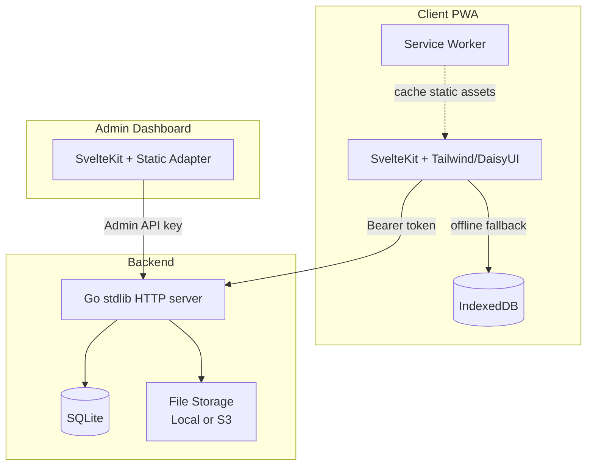
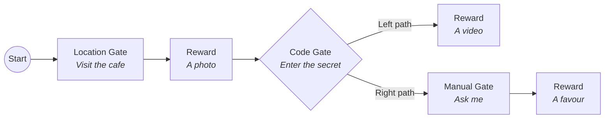

<p align="center">
  
</p>

<h1 align="center">Eros</h1>

<p align="center">
  A graph-based treasure hunt app for couples.
  <br />
  Design scavenger hunts with gates, rewards, and branching paths — then watch your partner play through them.
</p>

---

## What is this?

Eros is a private app built for two people. One person (the admin) designs interactive treasure hunts as directed graphs — chains of challenges and rewards connected by branching paths. The other person (the client) navigates those graphs on their phone, unlocking gates by visiting locations, entering codes, or waiting for manual approval, and discovering rewards along the way.

Think of it as a personalised advent calendar meets a scavenger hunt, with the flexibility to build anything from a simple linear sequence to a multi-path adventure.

The whole system is self-hosted: a Go backend, an admin dashboard for building hunts, and a PWA client for playing them.

---

## Architecture

Eros is a monorepo with three components:



The **admin dashboard** is a static site for designing graphs and managing the system. It authenticates with a static API key.

The **client PWA** is an offline-first mobile app. It caches data in IndexedDB and serves static assets from a service worker, so it works without a network connection. It authenticates via device tokens issued during a one-time registration flow.

The **backend** is a single Go binary with no external dependencies beyond a CGo SQLite driver. It handles auth, graph logic, file storage, and the favour system.

---

## How Graphs Work

The core concept in Eros is the **graph** — a directed graph of nodes connected by edges. Each graph represents one treasure hunt experience.



There are two categories of node:

**Gate nodes** block progress until a condition is met:

| Gate | How it unlocks |
|------|---------------|
| **Location** | Player is within a radius of target coordinates (haversine distance check) |
| **Code** | Player enters the correct text code |
| **Manual** | Admin approves the unlock from the dashboard |

**Reward nodes** are the payoff — images, videos, markdown text, files, or favours (redeemable tokens the player can spend on real-world things).

Edges can carry **choice labels**, creating branching paths where the player picks which way to go. The client only ever sees unlocked nodes plus the immediate next step — future content stays hidden.

Each graph has a **starting date**. Before that date, the client sees a countdown timer. After it, the graph appears in a calendar view and becomes playable.

---

## Features

**Admin Dashboard**
- Visual graph editor (drag-and-drop nodes, connect edges, edit inline) powered by SvelteFlow
- Polymorphic node editing — each gate and reward type has its own edit dialog
- Device management — view registered devices, revoke access, see last-seen timestamps
- Registration code system with QR code PDF export
- Favour economy management — define choices, set costs, fulfil requests
- Graph calendar view organised by start date

**Client PWA**
- Offline-first with IndexedDB caching and service worker
- QR code scanner for device registration (camera + manual fallback)
- Countdown timer to upcoming treasure hunts
- Calendar view with status indicators (available / in progress / completed)
- Full-screen node progression with branching choice screens
- Installable as a home screen app (standalone PWA)

**Backend**
- Single binary, single SQLite file — no infrastructure to manage
- File storage abstracted behind an interface (local filesystem or S3-compatible)
- Custom AWS SigV4 implementation for S3 — no SDK dependency
- Layered architecture with clean separation: handler → service → repository
- Favour system with transactional balance tracking

---

## Tech Stack

| Layer           | Technology                                                          |
|-----------------|---------------------------------------------------------------------|
| Backend         | Go 1.26, stdlib `net/http`, SQLite via `go-sqlite3` (CGo)           |
| Admin frontend  | SvelteKit (Svelte 5), TypeScript, Vite 7, SvelteFlow, scoped CSS    |
| Client frontend | SvelteKit (Svelte 5), TypeScript, Vite 7, Tailwind CSS 4, DaisyUI 5 |
| Icons           | lucide-svelte                                                       |
| Database        | SQLite with WAL mode                                                |
| External deps   | One: `github.com/mattn/go-sqlite3`. Everything else is Go stdlib.   |

---

## Getting Started

### Prerequisites

- **Go 1.26+** with CGo enabled (required for the SQLite driver)
- **Node 24** (see `.nvmrc` in both frontend directories)
- **npm**

### Backend

```bash
cd backend

# Create the private config with your admin API key
cat > config.private.json << 'EOF'
{
  "admin": {
    "api_key": "your-secret-admin-key"
  }
}
EOF

# Run the server (defaults to localhost:8080)
go run ./cmd/server
```

The server creates `db.sqlite` automatically on first run and initialises the schema.

### Admin Dashboard

```bash
cd admin
npm install
npm run dev
```

Opens at `http://localhost:5173`. Log in with the admin API key you set above.

### Client PWA

```bash
cd client
npm install
npm run dev
```

Opens at `http://localhost:5174`. Register a device using a registration code created from the admin dashboard.

---

## Project Structure

```
eros/
├── backend/
│   ├── cmd/server/          # Entry point — wires dependencies, starts server
│   ├── internal/
│   │   ├── config/          # 4-layer config: default → env → private → env vars
│   │   ├── models/          # Domain types: Graph, Node, Edge, Device, Favour
│   │   ├── handler/         # HTTP handlers + middleware (auth, CORS, logging)
│   │   ├── service/         # Business logic layer
│   │   └── repository/      # Data access interface + SQLite implementation
│   └── pkg/                 # Shared packages: apierror, response, authctx
│
├── admin/                   # SvelteKit admin dashboard (adapter-static)
│   └── src/
│       ├── routes/          # /login, / (devices), /favours, /graphs, /graphs/[id]
│       └── lib/             # API client, auth state, components, graph editor
│
├── client/                  # SvelteKit client PWA (adapter-static, SPA fallback)
│   └── src/
│       ├── routes/          # /login, /logout, (app)/ (home + graph play)
│       ├── lib/
│       │   ├── api/         # Raw HTTP calls, one file per resource
│       │   ├── db/          # IndexedDB wrapper, schema, typed stores
│       │   ├── services/    # Orchestration: online → fetch+cache, offline → read
│       │   └── types/       # TypeScript interfaces and enums
│       └── service-worker.ts
│
└── bruno/                   # Bruno API testing collections
```

---

## Configuration

The backend loads configuration in four layers, each overriding the previous:

1. **`config.default.json`** — Sensible defaults (timeouts, WAL mode, logging)
2. **`config.{APP_ENV}.json`** — Environment-specific (`develop` or `production`)
3. **`config.private.json`** — Secrets like the admin API key (gitignored)
4. **Environment variables** — Highest priority. Every config field has an `env:` tag.

Key environment variables:

| Variable            | Description                 | Default     |
|---------------------|-----------------------------|-------------|
| `APP_ENV`           | `develop` or `production`   | `develop`   |
| `SERVER_PORT`       | Port the backend listens on | `8080`      |
| `ADMIN_API_KEY`     | Static key for admin auth   | —           |
| `DATABASE_PATH`     | Path to SQLite file         | `db.sqlite` |
| `FILE_STORAGE_TYPE` | `local` or `s3`             | `local`     |

Both frontends use `PUBLIC_SERVER_URL` to point at the backend (no `/api` suffix — all endpoint paths include it).

---

## Development

```bash
# Backend
cd backend
go vet ./...              # Static analysis
go run ./cmd/server       # Run dev server

# Admin
cd admin
npm run dev               # Dev server on :5173
npm run lint              # ESLint
npm run format            # Prettier check
npm run build             # Static build

# Client
cd client
npm run dev               # Dev server on :5174
npm run lint
npm run format
npm run build
```

API testing collections for [Bruno](https://www.usebruno.com/) live in the `bruno/` directory, organised by admin and client endpoints.

Backend tests use Go's stdlib `testing` package. Run `go test ./...` from `backend/` for unit tests, or `go test -tags integration ./...` to include integration tests (requires CGo for SQLite).

---

## Status

Eros is an active personal project. The core graph creation and play-through loop works end to end. See [TODO.md](./TODO.md) for the current roadmap — gate unlock UI, file management, and the client-side favour system are the main items in progress.

---

## License

This is a personal project. No license is currently specified.
